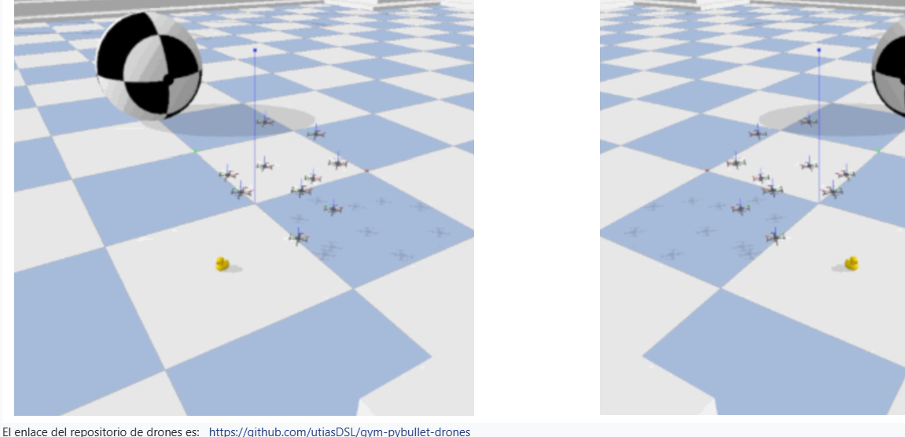

# Práctica Real-to-Sim: control de un dron simulado desde una ESP32

**Asignatura:** Micros — Universidad Militar Nueva Granada
**Simulador base:** [gym-pybullet-drones](https://github.com/utiasDSL/gym-pybullet-drones)

## 1. Introducción

Esta práctica traslada al simulador PyBullet la lógica de control que normalmente
correría en hardware real: una tarjeta **ESP32** decide *a dónde* debe moverse un dron,
y esa decisión se refleja en un cuadricóptero virtual que responde con un controlador
PID. El objetivo es entender el flujo completo — percepción/decisión en el
microcontrolador, comunicación serial, y ejecución física en el simulador — sin
necesitar un dron real ni arriesgar hardware costoso.

## 2. Objetivos

- Configurar un entorno de simulación de drones basado en PyBullet.
- Establecer comunicación serial entre una ESP32 y un script de control en Python.
- Mover un dron simulado de manera secuencial por tres puntos del espacio (A, B y C),
  con la secuencia gobernada por eventos generados en la ESP32.

## 3. Arquitectura de la solución

```
   ESP32                      PC (Python)                    Simulador
┌───────────┐   Serial USB   ┌─────────────────┐   PyBullet  ┌────────────┐
│ Botón BOOT│ ─────────────▶ │ 02_control_      │ ──────────▶ │ Dron CF2X   │
│ (decide)  │  "WP,B,1,1,1"  │ esp32.py (IK/PID)│             │ (ejecuta)   │
└───────────┘                └─────────────────┘             └────────────┘
```

La ESP32 no controla un motor real: emite texto plano por el puerto serie con el
formato `WP,<punto>,<x>,<y>,<z>`. El script de Python interpreta ese texto y lo entrega
al controlador PID de `gym-pybullet-drones` como posición objetivo del dron.

## 4. Estructura del repositorio

```
real-to-sim-drones-esp32/
├── 01_prueba_simulador.py        Valida el simulador solo (sin ESP32): A → B → C automático
├── 02_control_esp32.py           Puente serial: ESP32 → simulador, en tiempo real
├── firmware/
│   ├── arduino/consola_drone.ino     Firmware para Arduino IDE (usado en esta práctica)
│   └── micropython/main.py           Firmware equivalente para Thonny / MicroPython
└── evidencias/
    └── simulacion.png             Captura de la simulación en ejecución
```

Solo se necesita **uno** de los dos firmwares, según la herramienta disponible.

## 5. Metodología / Puesta en marcha

### 5.1. Entorno de Python

`gym-pybullet-drones` requiere Python ≥ 3.12. Se recomienda Miniconda para evitar
problemas al compilar `pybullet` en Windows:

```bash
conda create -n drones python=3.12 -y
conda activate drones

git clone https://github.com/utiasDSL/gym-pybullet-drones.git
cd gym-pybullet-drones
pip install --upgrade pip
pip install -e .
pip install pyserial
cd ..
```

Validación del simulador, sin depender aún de la ESP32:

```bash
python 01_prueba_simulador.py
```

### 5.2. Programación de la ESP32

**Con Arduino IDE** (usado en esta práctica): abrir `firmware/arduino/consola_drone.ino`,
seleccionar la placa *ESP32 Dev Module* y el puerto correspondiente, y subir el sketch.

**Alternativa con MicroPython/Thonny:** instalar MicroPython en la placa y guardar
`firmware/micropython/main.py` como `main.py` en el dispositivo.

Ambos firmwares generan el mismo protocolo de mensajes, de modo que
`02_control_esp32.py` funciona sin cambios con cualquiera de los dos.

### 5.3. Ejecución conjunta

Con el monitor serie del IDE cerrado (para liberar el puerto COM) y la ESP32 conectada:

```bash
python 02_control_esp32.py
```

Cada pulsación del botón **BOOT** de la placa avanza el dron al siguiente punto de la
secuencia A → B → C → A...

## 6. Protocolo de comunicación

| Campo | Descripción |
|---|---|
| `WP` | Encabezado fijo del mensaje |
| `<punto>` | Etiqueta del punto (A, B o C) |
| `x, y, z` | Coordenadas objetivo, en metros |

Ejemplo: `WP,B,1.0,1.0,1.0`

| Punto | x (m) | y (m) | z (m) |
|---|---|---|---|
| A | 0.0 | 0.0 | 1.0 |
| B | 1.0 | 1.0 | 1.0 |
| C | 2.0 | 0.0 | 1.0 |

## 7. Resultados

El dron simulado completó el recorrido A → B → C respondiendo a los eventos generados
por la ESP32, con el controlador PID de `gym-pybullet-drones` estabilizando la
trayectoria entre cada punto.



## 8. Conclusiones

- La separación entre "decisión" (ESP32) y "ejecución física" (simulador) reproduce, a
  escala de prototipo, la arquitectura típica de un sistema embebido que gobierna un
  actuador remoto.
- Un protocolo serial simple basado en texto plano es suficiente para coordinar ambos
  lados sin necesitar librerías adicionales de comunicación.
- El mismo esquema es extensible a más puntos de ruta o a un control continuo (joystick)
  en lugar de eventos discretos por botón.

## Referencias

- Simulador: https://github.com/utiasDSL/gym-pybullet-drones
